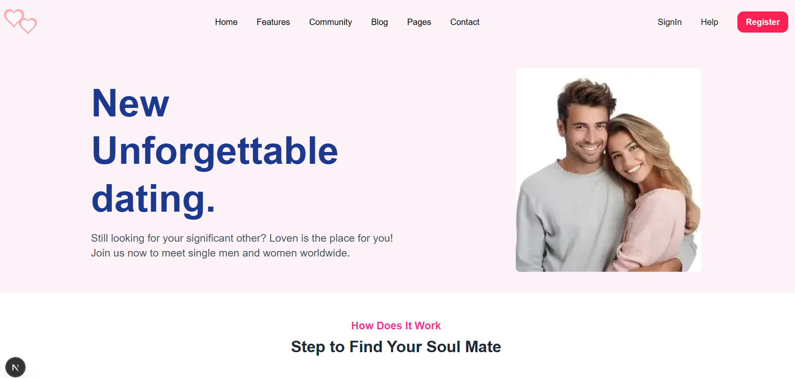
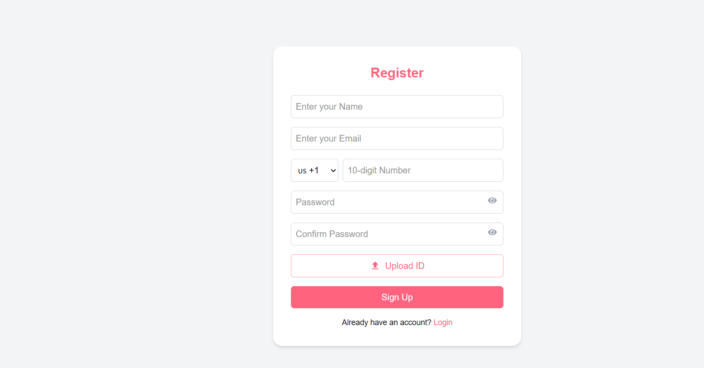
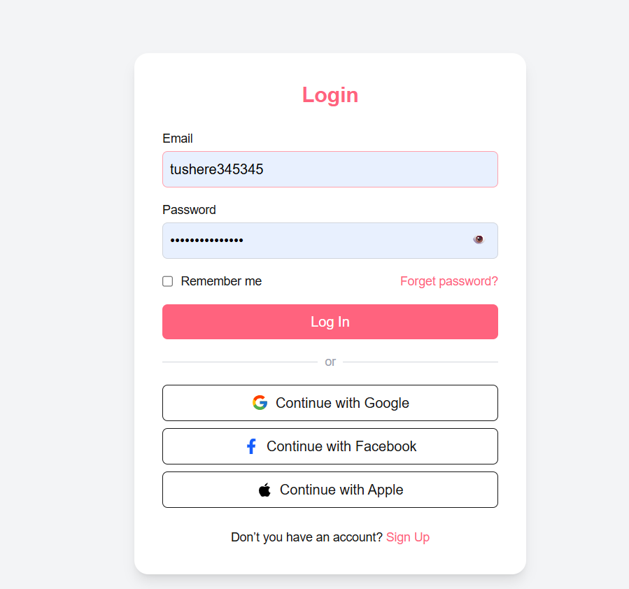
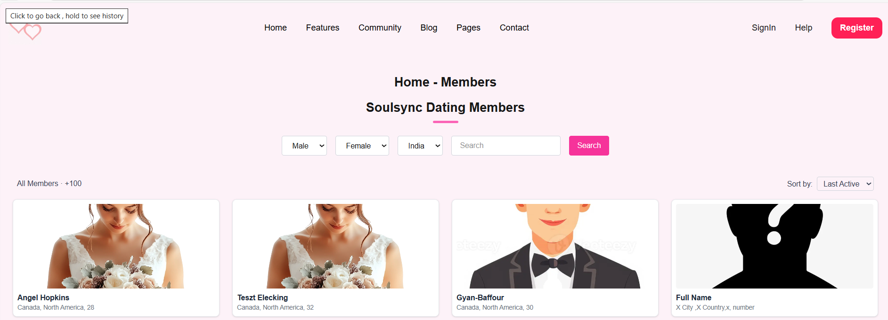
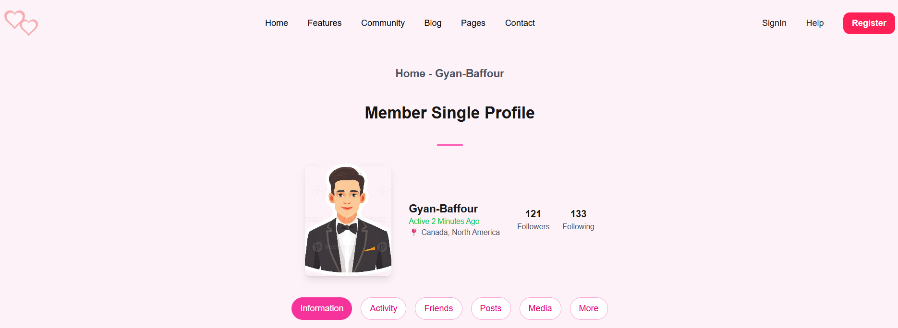
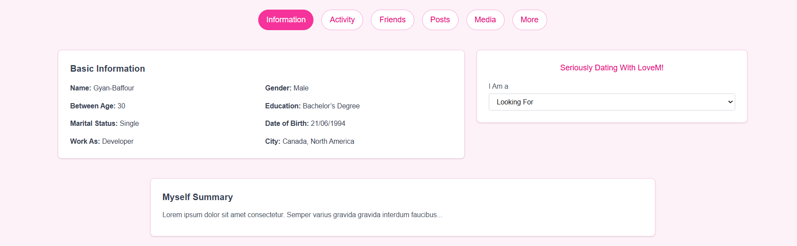

# 💖 Find Your Love

A modern and responsive dating web application made with **Next.js**, designed to help people connect and find meaningful relationships. This platform offers a sleek UI, secure authentication, and personalized matchmaking features.

---

## 🚀 Features

- 🧑‍💼 Register and login functionality  
- 🔐 Secure password handling  
- 🌍 Member listing with search and filters (by gender, country, etc.)  
- 📸 Upload ID verification  
- 🔁 Third-party logins (Google, Facebook, Apple)  
- ✨ Clean, modern UI design  

---

## 🖼️ Screenshots

### 🏠 Homepage


### 📝 Registration Page

### 🔐 Login Page


### 👥 Members Listing Page


### 👥 Single Member profile



---

## 🛠️ Tech Stack

- **Frontend**: Next.js, React.js, Tailwind CSS  
- **Auth**: JWT / OAuth (Google, Facebook, Apple)  
- **Design**: Figma *(assumed)*  

---

## 📁 Project Structure

```bash
├── pages/
│   ├── index.js
│   ├── register.js
│   ├── login.js
│   └── members.js
├── components/
├── public/
│   └── assets/       # Screenshots or static images
├── styles/
├── README.md
